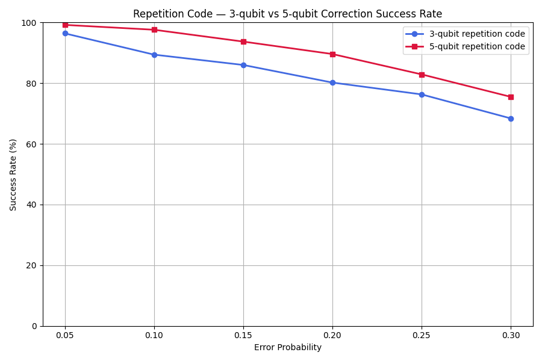

# Repetition Code Simulator

A Python-based simulator demonstrating 3-qubit and 5-qubit quantum repetition codes for bit-flip error correction.

## Features

-  3-qubit repetition code
-  5-qubit repetition code
-  Bit-flip error simulation
-  Majority-vote decoding
-  Performance comparison
-  Visualization using Matplotlib

## Installation

```bash
pip install matplotlib numpy
```

## Run

```bash
python simulator.py
```

## Example Result



## Repository Structure

```
repetition-code-simulator/
│── simulator.py
│── results.png
│── results_comparison.png
│── README.md
```

## Technologies Used

- Python
- NumPy
- Matplotlib
- Quantum Error Correction concepts

## Author
Anika Tabassum